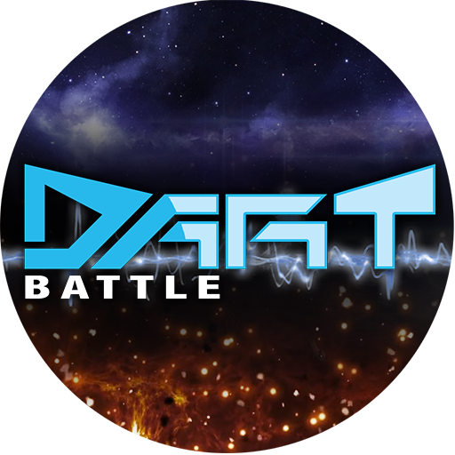

# dartBattle
Amazon Alexa skill for augmented play with foam-based weaponry.

* [Summary](#summary)
* [Features](#features)
  * [Introduction & Help](#introduction-&-help)
  * [Commands](#commands)
  * [Rich Media](#rich-media)
  * [Teams](#teams)
  * [Roles](#roles)
  * [Battles](#battles)
  * [Events](#events)
  * [Rank](#rank)
  * [Victories](#victories)
  * [Rules](#rules)
  * [To Do](#to-do)
* [Technical Documentation](#technical-documentation)
  * [main.py](#mainpy)
  * [battle.py](#battlepy)
  * [database.py](#databasepy)
  * [events.py](#eventspy)
  * [playlists.py](#playlistspy)
  * [protocols.py](#protocolspy)
  * [rank.py](#rankpy)
  * [responses.py](#responsespy)
  * [roles.py](#rolespy)
  * [session.py](#sessionpy)
  * [teams.py](#teamspy)
  * [victories.py](#victoriespy)
  * [test.py](#testpy)

## Summary
Dart Battle is a fully featured game companion built for Amazon Alexa, which provides players using foam-based projectile weapons with features such as timed battles, soundtracks, vivid scenarios with dialog and sound effects, rules, score keeping, premium DLC, team building, team role assignments, rank advancement, and random events mid-game with a variety of objectives.

## Features

### Introduction & Help
Dart Battle utilizes Amazon's DynamoDB to maintain an awareness of a user's history with the game, and is therefore capable of detecting when a user is new to Dart Battle. Upon a user's first visit, they will be greeted with a special message from the "Commander" and given the option to listen to the help information.

The help information is available at any time to anyone by invoking Alexa's standard Help Intent ("Alexa, help" or similar). This feature playsa short audio clip from the Commander asking your "Tactical Computer" to list available commands. Following that, Alexa's voice simulator walks the user through the numerous available commands.

### Commands
Commands available to the user are:
* TEAMS
  * "Setup teams"
  * "Tell me the teams"
  * "Shuffle teams"
  * "Clear the teams"
* BATTLES
  * "Start a battle"
  * "Start a _ minute battle", where the user specifies the number of desired minutes
  * "Enable events"
  * "Disable events"
* RANK
  * "What rank am I"
* VICTORIES
  * "Record a victory"
  * "Tell me the victories"
  * "Tell me the victories for _", where the user specifies the name of the team or player for which to list victories
  * "Clear all victories"
  * "Clear victories for _", where the user specifies the name of the team or player for which to clear victories
* PROTOCOLS
  * "Enable protocol _", where the user specifies the name of a protocol (a secret code) to unlock exclusive game content
  * "Disable protocol _", where the user specifies the name of a protocol (a secret code) to turn off exclusive game content
* AUDIO DIRECTIVES
  * Most standard Amazon audio directives are supported, including: "Pause", "Start over", "Stop", "Resume", "Previous", "Next", "Skip"
  * Some standard Amazon audio directives are disabled, including: "Loop", "Shuffle", "Repeat"
* OTHER
  * "How do I play"
  * "More Options"

### Rich Media
Dart Battle supports Alexa devices with screens, and will display cards with images and text whenever a response is provided. During the battle, Amazon's audio player is displayed along with the Dart Battle artwork and standard playback controls.

### Teams
Dart Battle supports the creation of two or more teams, randomly assigning individuals to teams, designating a captain, and assigning random combat roles to other team members. When forming a team, Dart Battle asks for the number of players, and then for each player's name (optionally, a user may provide player numbers or nicknames). That list is divided by the number of teams desired, ensuring that team sizes are as consistent as possible (the code contains checks to prevent a user asking for more teams than there are available players). The result is then read aloud to the user.

At any point, the user may ask for Dart Battle to "Tell me the teams" at which place the existing teams and roles are read aloud to the user.

The user may request to "Shuffle the teams" which will use the existing list of players and desired number of teams to form new teams with new captains and new roles.

The user may elect to "Clear the teams" returning Dart Battle to an individual, or "everyone for themselves" mode.

Some random events are only applicable to teams. Therefore, playing Dart Battle in team mode will result in a more unpredictable battle with the potential for more varied objectives. Roles are only applicable to team play.

### Roles
Players who join teams will be assigned roles to enrich their imaginative gameplay and to potentially give them exclusive tasks through events.  Each team needs a captain, so one member of the team will receive that role always. Additional roles are:
* Communication Specialist (available through a secret code, aka. "protocol", provided to users who complete challenges on https://dartbattle.fun)
* Computer Specialist
* Electrician
* Explosives Expert
* Heavy Weapons Expert
* Intelligence Officer
* Mechanic
* Medic
* Pilot
* Science Officer
* Scout
* Sniper
* Special Forces Operative

Roles not only give players some imaginative prompts to help them play out fantasies on the battlefield, but may also enable specific members of the team to earn points for their team by completing objectives exclusive to their role through random [events](#events).

### Battles
Battles provide players with a framework within which to carry out their competitive gameplay at home. They provide a clear beginning and end to the battle, helping to reduce conflict between players, and provide rich imaginative play through music, characters, and dialog which are themed to different locations, conditions, and eras in history. Battles are comprised of sections of music which can be as short as 30 seconds and as long as 2 minutes. By specifying a duration for a battle, the user causes the code to divide the user's requested number of minutes into smaller chunks, allowing the insertion of one or more events, and using the available sections of music to form a battle of the desired length.  The default battle length is 5 minutes which allows for two events during the battle.

Once the battle is formed, an introduction unique to the randomly-chosen scenario is prepended, along with a clear countdown until the start of battle. This allows players to get into their starting positions, behind cover or in strategic positions, before battle begins.

Once the battle concludes, a reminder is issued for the user to record the victory, and a "tail" may be added to the very end which might be a reminder to rate the Alexa Skill in the Skill Store, or to visit Dart Battle on Facebook, or to visit https://dartbattle.fun, or similar.

Due to limitations imposed by Amazon on apps that trigger audio playback using the Audio Directives, the skill exits after a battle, and the user is free to start Dart Battle again or to reinvoke Dart Battle by saying "Alexa, tell Dart Battle to _", such as "record a victory" or "start a battle".

### Events
Events provide interruptions during battle, issuing new objectives to players, thereby changing the dynamics of gameplay for players and using dialog and sound effects to reinforce the theme of the chosen scenario.  Each scenario has unique events with unique dialog and sound effects, but they all fall into the following categories:

* Cease Fire
  * For the reminder of the event, no one is allowed to discharge their weapon, or they suffer negative points. This allows players to reposition, regroup, or resupply safely without the fear of being hit.
* Drop And Roll
  * For scenarios including fire, this forces players to drop and roll, or else suffer negative points. This forces people in strategic nests to leave their cover momentarily, giving opponents a chance to hit them.
* Duel
  * This scenario pits two opposing team members against one another, allowing one to be a hero by scoring bonus points for their team.
* Exclusive Shot
  * For the remainder of the event, this event gives one and only one player the ability to fire, while all others are restricted from discharging their weapon under penalty of negative points.
* Hold On
  * For scenarios including earthquakes, large explosives, etc., this event forces players to run to a fixed object and hold on for the duration of the event. This might draw some opponents out of hiding.
* Lay Down
  * All players must lay prone on the ground for the remainder of the event. This may render opponents more or less vulnerable, depending on their position.
* Pair Up
  * For team play, this event forces teams to find a buddy with whom to pair before the end of the event, or risk suffering negative points.
* Protect
  * For team play, this event forces members of a team to protect one specified member. The team suffers negative points if the specified member is hit.
* Reset
  * This event forces players to return to their starting locations, and it wipes out the score thus far in battle. This can be a real game changer, allowing an underdog team the chance at a surprise victory.
* Resupply
  * This event restricts any discharge of weapons until a player has acquired the specified number of additional foam projectiles. This gives teams a chance to reload weapons without fear of being hit.
* Retreat
  * This event forces teams to regroup behind their lines, and may significantly change the battlefield during battle.
* Specific Target
  * This event specifies a single opposing team member that must be hit before the end of the event. Teams have the chance to score bonus points if that specified member is hit.
* Shelter
  * This event forces players to find an enclosed space or a space that provides cover from above until the end of the event.
* Split Up
  * This event forces team members to maintain a minimum distance between friendly team members until the conclusion of the event, potentially breaking up strategic nests or partnerships for a time.
* Tag Feature
  * This event requires team members to reach a specified target before the conclusion of the event. This target might be a light, a door, a plant, etc. This has the potential to break up teams and close the distance with opponents.
* Tag In Order
  * This event specifies multiple targets that must be reached in a particular order. These targets are likely team members from youngest to oldest, shortest hair to longest, etc. This has the potential to introduce confusion, chatter, and hopefully laughter in the midst of battle.
* Tag Many To One
  * This event forces team members to tag one specific team member before the conclusion of the event. For instance, everyone must reach the team captain under penalty of negative points.
* Tag One To Many
  * This event forces one team member to reach as many friendly team members as possible before the conclusion of the event. For instance, the medic must reach as many team mates as possible, with bonus points for each one reached.
* Zero Eliminations
  * This rare event rewards teams who have protected at least one team member from any eliminations by allowing the team to halve all points against them at the end of the battle.

Events can be turned off, if players prefer just music while they play, without any dialog, sound effects, or random events. To do this, players simply ask Dart Battle to "disable events". They can be re-enabled by asking Dart Battle to "enable events".

### Rank
Dart Battle rewards loyal players! It keeps track of the number of battles that a user has invoked, and increases the user's rank based on the number of battles played. Rank advancement is as follows:

* 1: Private
* 5: Corporal
* 15: Sergeant
* 30: Lieutenant
* 60: Captain
* 100: Lieutenant Colonel
* 140: Colonel
* 175: Brigadier General
* 200: Major General
* 250: Lieutenant General
* 300: General

As users advance in rank, they are addressed by the appropriate rank whenever Dart Battle is started up, and throughout certain interactions with Dart Battle. Upon earning a promotion, when Dart Battle starts up, a congratulatory message is played for the user.  Upon achieving Lieutenant Colonel, special greetings reserved for high-ranking officers are played when starting Dart Battle and during certain interactions with Dart Battle.

A user can check their current rank and how many battles are left before promotion by asking Dart Battle "What's my rank?".

### Victories
Dart Battle can keep track of the victories for teams or individuals. This information is stored in a database and persists between sessions.

Upon asking Dart Battle to "record a victory", the victor's name is prompted. The user may provide a team name or the name of an individual, and a record is created for that player if it does not already exist. If it exists, the number of victories is incremented.

Upon asking Dart Battle to "tell me the victories", if any victories were recorded for the current day, the response begins with the top player of the day, and then lists victories from highest to lowest for the day. The response then includes lifetime victories, starting with the top player of all time and then listing the three top lifetime players along with their scores.  The user may ask Dart Battle to "tell me the victories for _" where they specify a name. In that case, today's total and the lifetime total victories for that individual or team is reported.

If the user wishes to reset victories for everyone across the lifetime of the skill, they may ask Dart Battle to "Clear All Victories". If they wish to clear all victories for a specific team or player, they can specify the name, asking Dart Battle to "Clear victories for _" and specifying the desired name.

### Rules
The rules can be accessed by asking Dart Battle "How do I play", and provide a generic framework for gameplay and safety that players can leverage to settle disputes or to get started. In reality, any gameplay rules can be specified by players amongst themselves, and they can still use Dart Battle to supplement their gameplay. Rules specify scoring points by hitting opposing players with foam-based projectiles, being careful to point out that headshots do not count. It specifies a cooldown after getting hit of 5 seconds before a player can rejoin the battle. It prompts users to be courteous and use good sportsmanship to settle disputes, to wear eye protection, and to have fun.

### To Do
- [ ] FIXME: Calling "Shuffle the teams" after having cleared teams returns an incorrect response.
- [ ] FIXME: Building the tracklist for available events fails when events are disabled.
- [ ] "Clear All Victories for Today" - allowing players to clear today's victories without affecting lifetime stats.
- [ ] Capture the Flag, Infection, and other game modes.

## Technical Documentation

The code in this repo is explicitly meant to be run from within an Amazon Lambda instance, invoked from a very specific Alexa skill which has been crafted through Amazon Developer Console, Alexa.  The skill will define "Intents" which inform the Machine Learning algorithms on how to match up incoming text-from-speech issued by a user with the handler that matches best the user's intent behind those words.

Some of the intents will specify "slots" that need filling (essentially variables, or pieces of information that need definition by the user) prior to being able to handle the intent. This code will contain some DialogDirectives that prompt the user to fill any missing slots prior to executing the handler.

Handlers are registered through Amazon's `skill_builder`, and define which handler is best to respond to which intents.

Various categories of things that Dart Battle supports are typically broken out into their own modules, with the `responses.py` module being a good catch-all places for handlers that do not have a better home.

This repo contains an insane amount of supporting code from Amazon that empowers the skill to interact with DynamoDB, Alexa (through the Software Development Kit), monetization, and other technologies. There are only a handful of modules specific to Dart Battle.

Details of the Dart Battle modules, located in `lambda/us-east-1_dartBattle/`, follows.

### main.py
This module serves as the entry point for the skill. This is where the `skill_builder` is defined, and where all handlers live and are registered.  Intents in this module include not only all custom intents, but also required intents, audio and monetization intents that are defined by Amazon.

### battle.py
This module contains all logic for starting a battle and interacting with the Audio Player during a battle including logic that supports pausing, resuming, skipping, restarting audio tracks.  Scenario objects exist that define themed battle scenarios like Arctic and Old West, with plans for many more.

### database.py
This module handles all interaction with the DynamoDB database on behalf of Dart Battle. This allows for the updating, clearing, and setting of data records for the database. Persistent attributes that define the user's preferences and last-known state are stored in the database, as well as their usage history.

### events.py
While events are mostly manifest in battle.py and in playlists.py, this module serves as a place to record the supported event categories and their associated enums.  This module has potential to grow to serve random events to battles, but as for now, that logic is highly integrated in the battle setup process and is better housed in battle.py.

### playlists.py
This module provides mechanisms for organizing a huge number of available audio tracks from Amazon S3 into playlists that manage their eligability for choosing based on certain conditions, their organization into what the purpose of those audio tracks might be (introduction vs. sountrack vs. event audio vs. promotion vs. greeting), and the theme that they belong to (Arctic, Old West, etc).

### protocols.py
This module contains all protocol definitions. "Protocol" is what Dart Battle calls secret codes that can unlock in-game content. Each protocol has a name, and a secret code that can be issued to players who participate in challenges, in surveys, or in marketing blasts.  Each protocol defines the actions to be taken when a protocol is enabled, and whether or not that protocol can be disabled.  Some protocols introduce new greetings for the user, and these protocols can be enabled, whereas protocols that unlock new player roles or grant battles toward rank promotion cannot be disabled.

### rank.py
This module defines player ranks, titles, and milestones that earn users a rank promotion. This contains a function for checking to see if the user needs to be promoted as well as a response generator for an intent that wishes to announce the player's current rank and number of battles remaining before the next promotion.

### responses.py
This module is a bit of a catch-all for intent responses that don't fit into another module. In here there are test responses that are used during the authoring of new handlers and intents, the help response, the rules of the game response, the welcome response, and the responses and functions used for toggling various settings on and off upon request.

### roles.py
This module contains all player roles, their titles and enums. Roles are modeled after various jobs such as pilot, medic, sniper, mechanic and more. They are assigned to players upon the formation of teams and are often referenced during random events during a battle. Therefore, they not only enrich the imaginative play but also functionally enrich gameplay by giving some players special tasks to perform.
### session.py
This is a helper module which makes interacting with the Amazon Alexa session easier. The object provided by Amazon can be difficult to work with, sometimes with complicated and unpredicable hierarchies of keys and values to navigate in order to derive desired information, and other times raising exceptions when a value is not set, as opposed to returning NoneTypes or empty sets.  The objects within this module make working with sessions easier by providing properties on an object to quickly derive desired information, and an object for handling request information including slots and their values, and statuses such as Empty.

### teams.py
This module deals with teams in Dart Battle -- setting up teams, reciting current teams, shuffling the teams around to form new teams, or clearing the teams to return to individual play mode. This module is responsible for assigning roles to team members as well.

### victories.py
This module handles victories. Victories are a score-keeping mechanism, independent of gameplay and optional for the user to leverage, which can keep track of daily and lifetime victories for a player or team name. This module allows for the recording of victories, the clearing of selected victories or all victories, and the recitation of victories from today and across the lifetime of the skill.  Victories are unique per user, meaning one user cannot find their global placement across all users, only those players that this particular user has recorded in the past.

### test.py
This module is used to test the interaction model programmatically. The top half of the module contains data definitions that mirror data being fed to handlers as well as the expected data from that handler. There is not a lot of coverage, but the module is useful to test some of the potentially fragile intents. This is designed to be run through the Alexa `ask cli` command line interface using the `ask run` command.
